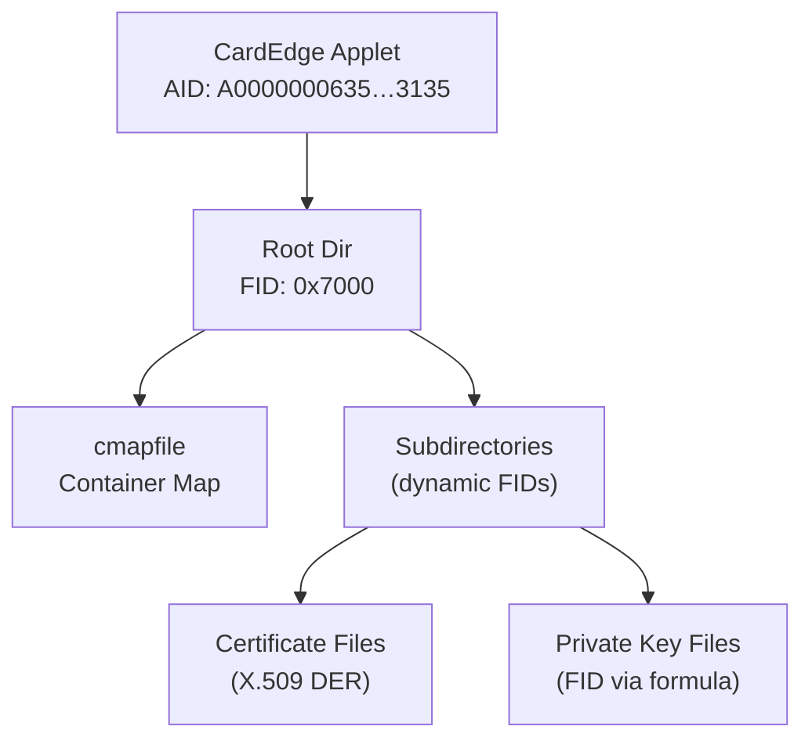

# CardEdge PKI — Applet File System Map

## Overview

| Property | Value |
|----------|-------|
| Applet | CardEdge PKI applet (PKCS#15 over MSCP) |
| Application AID | `A0 00 00 00 63 50 4B 43 53 2D 31 35` |
| Authentication | PIN required for cryptographic operations; directory/cert reading is unauthenticated |
| Plugin | `cardedge` |

Shared by Serbian eID (Gemalto/IF2020), Serbian health insurance card, and PKS Chamber of Commerce qualified signature cards.

## File System Structure

### ASCII Tree

```
CardEdge Applet (AID: A000000063504B43532D3135)
└── Root Dir (0x7000)
    ├── <subdir>  — nested directories discovered at runtime
    │   ├── <cert file>  — X.509 certificate (DER)
    │   ├── <key file>   — private key reference
    │   └── ...
    ├── cmapfile  — container map (CMAP records)
    └── ...
```

The directory structure is dynamic — file and directory FIDs are discovered by parsing directory entries starting from the root directory at FID `0x7000`.

### Mermaid Diagram



## Directory Layout

Directories are read as flat binary files. The format is a fixed 10-byte header followed by variable-length 12-byte entries.

### Directory Header (10 bytes)

| Offset | Size | Field | Description |
|--------|------|-------|-------------|
| 0 | 1 | LeftFiles | Remaining file slots |
| 1 | 1 | LeftDirs | Remaining directory slots |
| 2 | 2 (LE) | NextFileFID | Next available file FID |
| 4 | 2 (LE) | NextDirFID | Next available directory FID |
| 6 | 2 (LE) | EntriesCount | Number of entries in this directory |
| 8 | 2 (LE) | WriteACL | Write access control |

### Directory Entry (12 bytes)

| Offset | Size | Field | Description |
|--------|------|-------|-------------|
| 0 | 8 | Name | File or directory name (null-padded ASCII) |
| 8 | 2 (LE) | FID | File identifier |
| 10 | 1 | IsDir | `1` = directory, `0` = file |
| 11 | 1 | Pad | Reserved (padding) |

## CMAP Record Layout

The container map file (`cmapfile`) contains 86-byte records describing PKCS#15 key containers. Based on Windows CNG `CONTAINER_MAP_RECORD`.

### CMAP Record (86 bytes)

| Offset | Size | Field | Description |
|--------|------|-------|-------------|
| 0 | 80 | wszGuid | Container GUID (UTF-16LE, null-padded) |
| 80 | 1 | bFlags | Bit 0: valid container; Bit 1: default container |
| 81 | 1 | bReserved | Reserved |
| 82 | 2 (LE) | wSigKeySizeBits | Signature key size in bits (0 if none) |
| 84 | 2 (LE) | wKeyExchangeKeySizeBits | Key-exchange key size in bits (0 if none) |

Flag constants:
- `0x01` — `CMAP_VALID_CONTAINER`: entry is valid
- `0x02` — default container

## Private Key FID Formula

Private key file identifiers are computed from the container index and key pair type:

```
FID = 0x6000
    | ((containerIndex << 4) & 0x0FF0)
    | ((keyPairId << 2) & 0x000C)
    | 0x0001   (CE_KEY_KIND_PRIVATE)
```

Key pair types:
- `AT_KEYEXCHANGE = 1` — encryption / key-exchange key pair
- `AT_SIGNATURE = 2` — digital-signature key pair

Example: container 0, signature key: `FID = 0x6000 | 0x0000 | 0x0008 | 0x0001 = 0x6009`

## PIN Details

| Property | Value |
|----------|-------|
| PIN Reference | `0x80` |
| Max Length | 8 characters (null-padded to 8 bytes) |
| Max Retries | 3 (resets on successful verification) |

PIN is required for cryptographic operations (signing, decryption). Reading directory listings, certificates, and the container map does not require PIN authentication.

## Read Procedure

1. **SELECT by AID:** `00 A4 04 00 0C A0 00 00 00 63 50 4B 43 53 2D 31 35`
2. **SELECT root directory:** `00 A4 00 00 02 70 00`
3. **READ BINARY** in 128-byte chunks: `00 B0 <offsetHi> <offsetLo> 80`
4. **Parse directory** header (10 bytes) + entries (12 bytes each)
5. **Recurse** into subdirectories by selecting their FIDs
6. **Read certificates** as DER-encoded X.509 binary files
7. **Read CMAP** records (86 bytes each) from the container map file
