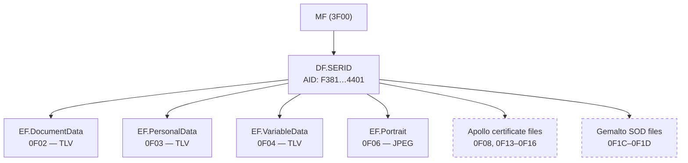

# Serbian eID — Applet File System Map

## Overview

| Property | Value |
|----------|-------|
| Applet | Serbian electronic identity card (citizen and foreigner) |
| Application AID | `F3 81 00 00 02 53 45 52 49 44 01` (SERID — citizen) |
|                 | `F3 81 00 00 02 53 45 52 49 46 01` (SERIF — foreigner, IF2020) |
|                 | `F3 81 00 00 02 53 45 52 52 50 01` (SERRP — foreigner, alt) |
| Authentication | None required for read |
| Plugin | `eid` |

## File System Structure

### ASCII Tree

```
MF (3F00)
├── DF.SERID (AID: F381000002534552494401)
│   ├── EF.DocumentData   (0F02) — TLV, tags 1546-1551, 1689
│   ├── EF.PersonalData   (0F03) — TLV, tags 1558-1566, 1582-1583
│   ├── EF.VariableData   (0F04) — TLV, tags 1568-1581
│   ├── EF.Portrait       (0F06) — binary JPEG, ~15 KB
│   ├── EF.UserCert1      (0F08) — X.509 certificate             [Apollo only]
│   ├── EF.CertVX         (0F13) — signing cert for variable data [Apollo only]
│   ├── EF.SignVX          (0F14) — variable data signature        [Apollo only]
│   ├── EF.CertFX         (0F15) — signing cert for fixed data    [Apollo only]
│   ├── EF.SignFX          (0F16) — fixed data signature           [Apollo only]
│   ├── EF.SOD_FX         (0F1C) — PKCS#7 SignedData, fixed data  [Gemalto/IF2020]
│   └── EF.SOD_VX         (0F1D) — PKCS#7 SignedData, variable    [Gemalto/IF2020]
```

### Mermaid Diagram



## Card Generations

| Generation | ATR Pattern | Certificate Model |
|-----------|-------------|-------------------|
| Apollo (pre-2014) | `3B B9 18 xx xx` | Separate cert + sig files (0F08, 0F13–0F16) |
| Gemalto (2014+) | `3B FF 94 xx xx` | PKCS#7 SOD files (0F1C–0F1D) |
| IF2020 | `3B FF 94 xx xx` | Same as Gemalto; uses SERIF/SERRP AID for foreigners |

## Data Elements

### EF.DocumentData (0F02)

| Tag | Field Key | Name | Type |
|-----|-----------|------|------|
| 1546 | doc_reg_no | Registration number | string |
| 1547 | document_type | Document type | string |
| 1548 | document_serial_number | Serial number | string |
| 1549 | issuing_date | Date of issue | string (DD.MM.YYYY) |
| 1550 | expiry_date | Expiry date | string (DD.MM.YYYY) |
| 1551 | issuing_authority | Issuing authority | string |
| 1689 | chip_serial_number | Chip serial number | string |

### EF.PersonalData (0F03)

| Tag | Field Key | Name | Type |
|-----|-----------|------|------|
| 1558 | personal_number | JMBG (personal ID number) | string (13 digits) |
| 1559 | surname | Surname | string (Cyrillic) |
| 1560 | given_name | Given name | string (Cyrillic) |
| 1561 | parent_given_name | Parent's given name | string (Cyrillic) |
| 1562 | sex | Sex | string (M/F) |
| 1563 | place_of_birth | Place of birth | string |
| 1564 | community_of_birth | Community of birth | string |
| 1565 | state_of_birth | State of birth | string |
| 1566 | date_of_birth | Date of birth | string (DD.MM.YYYY) |
| 1583 | nationality | Nationality | string |
| 1582 | status_of_foreigner | Foreigner status | string |

### EF.VariableData (0F04)

| Tag | Field Key | Name | Type |
|-----|-----------|------|------|
| 1568 | state | State of residence | string |
| 1569 | community | Community | string |
| 1570 | place | Place | string |
| 1571 | street | Street | string |
| 1572 | house_number | House number | string |
| 1573 | house_letter | House letter | string |
| 1574 | entrance | Entrance | string |
| 1575 | floor | Floor | string |
| 1578 | apartment_number | Apartment number | string |
| 1580 | address_date | Address registration date | string |
| 1581 | address_label | Address label | string |

### EF.Portrait (0F06)

Binary JPEG image, approximately 15 KB. No TLV encoding — raw JPEG data.

## Read Procedure

1. **SELECT by AID:** `00 A4 04 00 0B F3 81 00 00 02 53 45 52 49 44 01`
2. **SELECT EF by path:** `00 A4 08 00 02 0F 02` (example: DocumentData 0F02)
3. **READ BINARY** in 255-byte chunks: `00 B0 <offsetHi> <offsetLo> FF`
4. **Parse response** as LE 16-bit TLV (tag and length are little-endian 16-bit values)

The TLV format used by Serbian eID is non-standard: both tag and length fields are 16-bit little-endian integers. Each record is `tag(2 LE) + length(2 LE) + value(length bytes)`.
