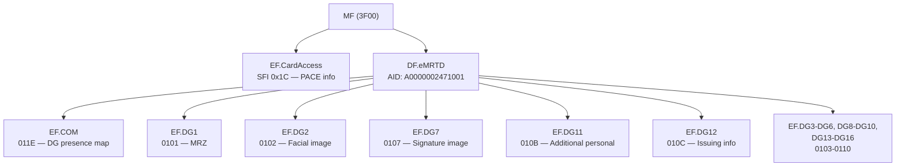

# eMRTD — Applet File System Map

## Overview

| Property | Value |
|----------|-------|
| Applet | Electronic Machine Readable Travel Document (eMRTD) |
| Application AID | `A0 00 00 02 47 10 01` |
| Standard | ICAO Doc 9303 (Machine Readable Travel Documents) |
| Authentication | PACE-MRZ, PACE-CAN |
| Scope | International — not country-specific |
| Plugin | `emrtd` |

## File System Structure

### ASCII Tree

```
MF (3F00)
├── EF.CardAccess (SFI 0x1C) — PACE SecurityInfo, read before applet SELECT
├── DF.eMRTD (AID: A0000002471001)
│   ├── EF.COM (011E) — Data Group presence map + LDS/Unicode versions
│   ├── EF.DG1 (0101) — MRZ data (document number, name, nationality, DOB, expiry)
│   ├── EF.DG2 (0102) — Facial image (JPEG/JPEG2000)
│   ├── EF.DG3 (0103) — Fingerprint(s) [Extended Access Control required]
│   ├── EF.DG4 (0104) — Iris image(s) [Extended Access Control required]
│   ├── EF.DG5 (0105) — Displayed portrait
│   ├── EF.DG6 (0106) — Reserved for future use
│   ├── EF.DG7 (0107) — Displayed signature or usual mark
│   ├── EF.DG8 (0108) — Data feature(s) — encoded security features
│   ├── EF.DG9 (0109) — Structure feature(s)
│   ├── EF.DG10 (010A) — Substance feature(s)
│   ├── EF.DG11 (010B) — Additional personal details
│   ├── EF.DG12 (010C) — Additional document details (issuing authority info)
│   ├── EF.DG13 (010D) — Optional details (country-specific)
│   ├── EF.DG14 (010E) — Security options (Active Authentication / PACE public key)
│   ├── EF.DG15 (010F) — Active Authentication public key
│   └── EF.DG16 (0110) — Person(s) to notify
```

### Mermaid Diagram



## Data Group File Identifiers

All Data Groups follow the formula: `FID = 0x0100 + DG_number`.

| Data Group | FID | Content |
|------------|-----|---------|
| DG1 | `01 01` | MRZ data (two or three line MRZ) |
| DG2 | `01 02` | Encoded facial image (mandatory) |
| DG3 | `01 03` | Encoded fingerprint(s) — requires EAC |
| DG4 | `01 04` | Encoded iris image(s) — requires EAC |
| DG5 | `01 05` | Displayed portrait image |
| DG6 | `01 06` | Reserved for future use |
| DG7 | `01 07` | Displayed signature or usual mark |
| DG8 | `01 08` | Data feature(s) |
| DG9 | `01 09` | Structure feature(s) |
| DG10 | `01 0A` | Substance feature(s) |
| DG11 | `01 0B` | Additional personal details (full name, address, phone, etc.) |
| DG12 | `01 0C` | Additional document details (issuing authority, date, etc.) |
| DG13 | `01 0D` | Optional details (country-specific data) |
| DG14 | `01 0E` | Security options (EAC/PACE DH parameters, CA public keys) |
| DG15 | `01 0F` | Active Authentication RSA/ECDSA public key |
| DG16 | `01 10` | Person(s) to notify |

## Special Files

| File | Identifier | Description |
|------|-----------|-------------|
| EF.CardAccess | SFI `0x1C` | Contains PACE SecurityInfo. Read from MF **before** applet SELECT. |
| EF.COM | FID `01 1E` | Lists which Data Groups are present and LDS/Unicode version info. |

## Authentication Methods

The eMRTD applet requires authentication before Data Groups can be read. Three methods are supported:

| Method | Input | Description |
|--------|-------|-------------|
| PACE-MRZ | MRZ | Password Authenticated Connection Establishment using MRZ data (document number, DOB, expiry). |
| PACE-CAN | CAN | PACE using the Card Access Number printed on the document. |

### Authentication Flow

1. Read EF.CardAccess from MF (SFI 0x1C) to determine supported PACE protocols
2. If PACE is supported, perform PACE before SELECT of eMRTD applet (accept `62xx` warnings)
3. SELECT eMRTD application (AID `A0 00 00 02 47 10 01`)
4. Read EF.COM to discover which Data Groups are present
6. Read individual Data Groups as needed

### MRZ Key Derivation (PACE-MRZ)

The `MRZData` structure provides the three fields used for key derivation:

- `documentNumber` — from MRZ line 1
- `dateOfBirth` — YYMMDD format from MRZ line 2
- `dateOfExpiry` — YYMMDD format from MRZ line 2

## DG1 — MRZ Fields

DG1 contains the full Machine Readable Zone, which includes:

- Document type (P = passport, I = ID card, etc.)
- Issuing state (3-letter code)
- Holder name (surname, given names)
- Document number + check digit
- Nationality
- Date of birth (YYMMDD) + check digit
- Sex
- Date of expiry (YYMMDD) + check digit
- Optional data + check digit
- Composite check digit

## Scanning with card_mapper

The `card_mapper` tool supports authenticated eMRTD scanning. Set MRZ or CAN
credentials via environment variables, then run:

```bash
export LIBRESCRS_TEST_MRZ_DOC="<document_number>"
export LIBRESCRS_TEST_MRZ_DOB="<YYMMDD>"
export LIBRESCRS_TEST_MRZ_EXPIRY="<YYMMDD>"
card_mapper --plugin emrtd --verbose
```

This performs PACE (or BAC fallback) authentication, reads EF.COM to discover
present data groups, reads EF.SOD, then reads each accessible data group and
prints a summary table with sizes and hex previews. EAC-protected DGs (e.g.
DG3, DG4) are reported as ACCESS DENIED.

See `tools/card_mapper/README.md` for full environment variable documentation.

## Implementation Reference

- Source: `lib/emrtd/include/emrtd/emrtd_types.h`
- AID constant: `emrtd::EMRTD_AID`
- FID helper: `emrtd::dgToFID(int dg)` returns `0x0100 + dg`
- EF.COM FID: `emrtd::FID_COM` = `0x011E`
- EF.CardAccess SFI: `emrtd::SFID_CARD_ACCESS` = `0x1C`
- Auth methods: `emrtd::AuthMethod::PACE_MRZ`, `PACE_CAN`
