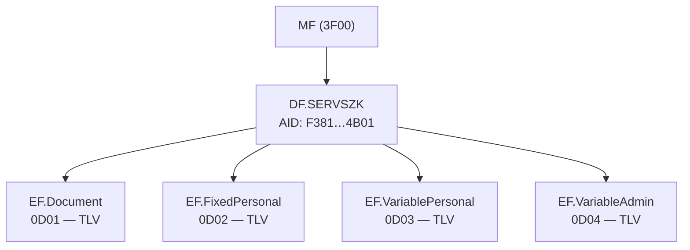

# Serbian Health Insurance — Applet File System Map

> **Note:** This applet is Serbian-specific. There is no known international standard for health insurance smart cards that this implementation follows.

## Overview

| Property | Value |
|----------|-------|
| Applet | Serbian health insurance card (RFZO) |
| Application AID | `F3 81 00 00 02 53 45 52 56 53 5A 4B 01` (SERVSZK) |
| Authentication | None required for read |
| Plugin | `health` |

## Known ATRs

| ATR | Description |
|-----|-------------|
| `3B F4 13 00 00 81 31 FE 45 52 46 5A 4F ED` | Health card variant 1 |
| `3B 9E 97 80 31 FE 45 53 43 45 20 38 2E 30 2D 43 31 56 30 0D 0A 6E` | Health card variant 2 |

## File System Structure

### ASCII Tree

```
MF (3F00)
└── DF.SERVSZK (AID: F38100000253455256535A4B01)
    ├── EF.Document         (0D01) — TLV, insurer/card info
    ├── EF.FixedPersonal    (0D02) — TLV, insurant identity
    ├── EF.VariablePersonal (0D03) — TLV, validity dates
    └── EF.VariableAdmin    (0D04) — TLV, address/insurance/carrier
```

### Mermaid Diagram



## File Header

Each file begins with a 4-byte header. The content length is stored at bytes [2:3] as a little-endian 16-bit integer. Data follows immediately after the header.

| Offset | Size | Field |
|--------|------|-------|
| 0 | 2 | Reserved |
| 2 | 2 (LE) | Content length |

## Data Elements

### EF.Document (0D01)

| Tag | Field Key | Name | Type |
|-----|-----------|------|------|
| 1553 | insurer_name | Insurer name | string |
| 1554 | insurer_id | Insurer ID | string |
| 1555 | card_id | Card ID | string |
| 1557 | date_of_issue | Date of issue | string |
| 1558 | date_of_expiry | Date of expiry | string |
| 1560 | print_language | Print language | string |

### EF.FixedPersonal (0D02)

| Tag | Field Key | Name | Type |
|-----|-----------|------|------|
| 1569 | insurant_number | Insurant number | string |
| 1570 | family_name | Family name (Cyrillic) | string |
| 1571 | family_name_lat | Family name (Latin) | string |
| 1572 | given_name | Given name (Cyrillic) | string |
| 1573 | given_name_lat | Given name (Latin) | string |
| 1574 | date_of_birth | Date of birth | string |

### EF.VariablePersonal (0D03)

| Tag | Field Key | Name | Type |
|-----|-----------|------|------|
| 1586 | valid_until | Valid until | string |
| 1587 | permanently_valid | Permanently valid | string |

### EF.VariableAdmin (0D04)

| Tag | Field Key | Name | Type |
|-----|-----------|------|------|
| 1601 | parent_name | Parent name (Cyrillic) | string |
| 1602 | parent_name_lat | Parent name (Latin) | string |
| 1603 | gender | Gender | string |
| 1604 | personal_number | Personal number (JMBG) | string |
| 1605 | street | Street | string |
| 1607 | municipality | Municipality | string |
| 1608 | place | Place | string |
| 1610 | address_number | Address number | string |
| 1612 | apartment | Apartment | string |
| 1614 | insurance_basis | Insurance basis | string |
| 1615 | insurance_desc | Insurance description | string |
| 1616 | carrier_relation | Carrier relation | string |
| 1617 | carrier_family_member | Carrier family member | string |
| 1618 | carrier_id_no | Carrier ID number | string |
| 1619 | carrier_insurant_no | Carrier insurant number | string |
| 1620 | carrier_family_name | Carrier family name (Cyrillic) | string |
| 1621 | carrier_family_name_lat | Carrier family name (Latin) | string |
| 1622 | carrier_given_name | Carrier given name (Cyrillic) | string |
| 1623 | carrier_given_name_lat | Carrier given name (Latin) | string |
| 1624 | insurance_start | Insurance start date | string |
| 1626 | country | Country | string |
| 1630 | taxpayer_name | Taxpayer name | string |
| 1631 | taxpayer_res | Taxpayer residence | string |
| 1632 | taxpayer_id_1 | Taxpayer ID 1 | string |
| 1633 | taxpayer_id_2 | Taxpayer ID 2 | string |
| 1634 | taxpayer_activ | Taxpayer activity | string |

## Read Procedure

1. **SELECT by AID:** `00 A4 04 00 0D F3 81 00 00 02 53 45 52 56 53 5A 4B 01`
2. **SELECT EF by FID:** `00 A4 02 00 02 0D 01` (example: Document 0D01)
3. **READ BINARY** header (4 bytes): `00 B0 00 00 04`
4. **Parse content length** from header bytes [2:3] (LE 16-bit)
5. **READ BINARY** content in 255-byte chunks: `00 B0 <offsetHi> <offsetLo> FF`
6. **Parse response** as LE 16-bit TLV (same format as Serbian eID)
