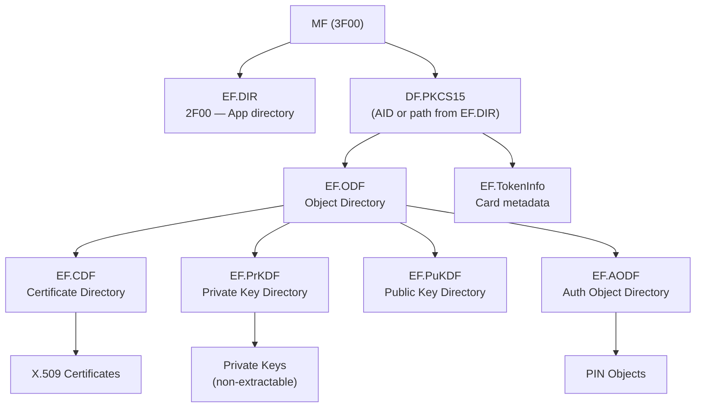

# PKCS#15 — Applet File System Map

## Overview

| Property | Value |
|----------|-------|
| Applet | PKCS#15 cryptographic token |
| Standard | ISO/IEC 7816-15 (Cryptographic Information Application) |
| Application AID | Discovered via AID SELECT or EF.DIR fallback |
| Authentication | PIN verification (per-object access control) |
| Scope | International standard — found on various card platforms |
| Plugin | `pkcs15` |

## File System Structure

### ASCII Tree

```
MF (3F00)
├── EF.DIR (2F00) — Application directory (fallback discovery)
├── DF.PKCS15 (discovered via AID or EF.DIR path)
│   ├── EF.ODF — Object Directory File (pointers to all object containers)
│   ├── EF.TokenInfo — Card/token metadata (label, serial, manufacturer)
│   ├── EF.CDF — Certificate Directory File (certificate index)
│   │   └── Certificate objects (X.509 certs at referenced paths)
│   ├── EF.PrKDF — Private Key Directory File (private key index)
│   │   └── Private key references (on-card, non-extractable)
│   ├── EF.PuKDF — Public Key Directory File (public key index)
│   │   └── Public key objects
│   └── EF.AODF — Authentication Object Directory File (PIN index)
│       └── PIN objects (verification references)
```

### Mermaid Diagram



## Standard Objects

### Object Directory File (ODF)

The ODF is the root index. It contains ASN.1-encoded pointers to all object container files:

| Pointer | Target | Description |
|---------|--------|-------------|
| `privateKeysPath` | EF.PrKDF | Private key directory |
| `publicKeysPath` | EF.PuKDF | Public key directory |
| `trustedPublicKeysPath` | Trusted PuKDF | Trusted public keys (CA keys) |
| `secretKeysPath` | Secret KDF | Symmetric key directory |
| `certificatesPath` | EF.CDF | Certificate directory |
| `trustedCertificatesPath` | Trusted CDF | Trusted/CA certificates |
| `usefulCertificatesPath` | Useful CDF | Useful (intermediate) certificates |
| `dataObjectsPath` | EF.DODF | Data object directory |
| `authObjectsPath` | EF.AODF | Authentication object directory |

### TokenInfo

Provides card-level metadata:

| Field | Description |
|-------|-------------|
| `label` | Human-readable token name |
| `serialNumber` | Unique token serial number |
| `manufacturer` | Card/token manufacturer |

### Certificate Objects (CDF)

Each certificate entry contains:

| Field | Description |
|-------|-------------|
| `label` | Human-readable certificate label |
| `id` | Object identifier (links cert to matching private key) |
| `authority` | Whether this is a CA certificate |
| `path` | File path to the X.509 certificate data |

### Private Key Objects (PrKDF)

Each private key entry contains:

| Field | Description |
|-------|-------------|
| `label` | Human-readable key label |
| `id` | Object identifier (matches corresponding certificate) |
| `keySizeBits` | Key size (e.g. 2048 for RSA-2048) |
| `path` | File path to the key reference |
| `accessFlags` | Access control flags |

### PIN Objects (AODF)

Each PIN entry contains:

| Field | Description |
|-------|-------------|
| `label` | Human-readable PIN label |
| `pinReference` | PIN reference byte for VERIFY command |
| `pinType` | Encoding: BCD, ASCII, UTF-8, HalfNibbleBCD, ISO 9564-1 |
| `minLength` | Minimum PIN length |
| `maxLength` | Maximum PIN length |
| `storedLength` | Padded length stored on card |
| `maxRetries` | Maximum retry count before blocking |
| `padChar` | Padding character |
| `path` | File path for PIN verification context |
| `local` | Whether PIN is local to this DF |
| `initialized` | Whether PIN has been set |
| `unblockDisabled` | Whether PIN unblocking is disabled |

## Applet Discovery

The PKCS#15 applet supports two discovery mechanisms, tried in order:

1. **AID SELECT** — direct selection of the PKCS#15 application by AID
2. **EF.DIR fallback** — read `MF/2F00` (EF.DIR), parse application templates to find the PKCS#15 DF path, then select by path

This dual approach ensures compatibility with cards that do not support AID-based selection.

## Current Usage

In LibreSCRS, the PKCS#15 applet is currently found alongside eMRTD on foreign eID cards. These cards expose both:
- An eMRTD applet for travel document data (biometrics, MRZ)
- A PKCS#15 applet for PKI operations (certificates, PIN-protected signing)

The PKCS#15 implementation could theoretically work standalone on any ISO 7816-15 compliant card.

## Implementation Reference

- Types: `lib/pkcs15/include/pkcs15/pkcs15_types.h`
- Card interface: `lib/pkcs15/include/pkcs15/pkcs15_card.h`
- ASN.1 parsers: `lib/pkcs15/include/pkcs15/pkcs15_parser.h`
- Key classes: `pkcs15::PKCS15Card`, `pkcs15::PKCS15Profile`
- Parser functions: `parseODF()`, `parseTokenInfo()`, `parseCDF()`, `parsePrKDF()`, `parseAODF()`
