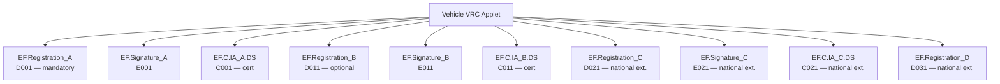

# Vehicle Registration Certificate (EU VRC) — Applet File System Map

## Overview

| Property | Value |
|----------|-------|
| Applet | Vehicle Registration Certificate per EU Directive 2003/127/EC |
| Standard | Commission Directive 2003/127/EC (amending Council Directive 1999/37/EC, Annex I Chapter III) |
| Application AID | Not standardized — each Member State requests AID from EU-designated laboratory |
| Data Format | BER-TLV (ISO/IEC 7816-4) |
| Authentication | None required for read |
| Plugin | `vehicle` |

## Standard References

- **Council Directive 1999/37/EC** — registration documents for vehicles
- **Commission Directive 2003/127/EC** — smart card (microprocessor) format specification
- **ISO/IEC 7816-3** — T=1 mandatory, T=0 optional
- **ISO/IEC 7816-4** — BER-TLV data objects, inter-industry commands
- **ISO/IEC 7816-5** — AID registration
- **ISO/IEC 8859-1/5/7** — character sets (Latin, Cyrillic, Greek)

## File System Structure

### EU Standard Files (Directive 2003/127/EC, Table 1)

| File | FID | Content | Status in Serbia |
|------|-----|---------|-----------------|
| `EF.Registration_A` | D001 | Mandatory registration data (tag `71` tree) | Present |
| `EF.Signature_A` | E001 | Electronic signature over EF.Registration_A | Present |
| `EF.C.IA_A.DS` | C001 | X.509v3 certificate for signature A | Present |
| `EF.Registration_B` | D011 | Optional registration data (tag `72` tree) | Present |
| `EF.Signature_B` | E011 | Electronic signature over EF.Registration_B | Present |
| `EF.C.IA_B.DS` | C011 | X.509v3 certificate for signature B | Present |

### Serbian Implementation (all 6 EU standard files + 4 national extensions)

```
Vehicle Registration Applet (selected via AID sequence)
├── EF.Registration_A (D001) — BER-TLV, mandatory data (EU standard)
├── EF.Signature_A    (E001) — electronic signature (EU standard)
├── EF.C.IA_A.DS      (C001) — X.509v3 certificate (EU standard)
├── EF.Registration_B (D011) — BER-TLV, optional data (EU standard)
├── EF.Signature_B    (E011) — electronic signature (EU standard)
├── EF.C.IA_B.DS      (C011) — X.509v3 certificate (EU standard)
├── EF.Registration_C (D021) — BER-TLV, national extension (Serbia-specific)
├── EF.Signature_C    (E021) — electronic signature (Serbia-specific)
├── EF.C.IA_C.DS      (C021) — X.509v3 certificate (Serbia-specific)
└── EF.Registration_D (D031) — BER-TLV, national extension (Serbia-specific)
```



## BER-TLV Container Structure

| Tag | Purpose |
|-----|---------|
| `78` | Compatible tag allocation authority (top-level wrapper) |
| `4F` | Application identifier inside `78` |
| `71` | Mandatory data container (EU harmonized fields) |
| `72` | Optional data container (EU + national extensions) |

## Data Elements — EU Mandatory (tag `71`)

### Registration & Document

| BER Tag Path | EU Code | Field Key | Name | Type |
|-------------|---------|-----------|------|------|
| `71 / 80` | — | version | Tag allocation version | string |
| `71 / 81` | A | registration_number | Registration number | string |
| `71 / 82` | B | date_of_first_registration | Date of first registration | string (YYYYMMDD) |
| `71 / 8D` | H | expiry_date | Period of validity / expiry date | string (YYYYMMDD) |
| `71 / 8E` | I | issuing_date | Registration date | string (YYYYMMDD) |
| `71 / 8F` | K | type_approval_number | Type-approval number | string |
| `71 / 9F33` | — | state_issuing | Member State name | string |
| `71 / 9F35` | — | competent_authority | Competent authority name | string |
| `71 / 9F36` | — | authority_issuing | Issuing authority name | string |
| `71 / 9F38` | — | unambiguous_number | Document number | string |

### Vehicle Identification

| BER Tag Path | EU Code | Field Key | Name | Type |
|-------------|---------|-----------|------|------|
| `71 / 8A` | E | vehicle_id_number | Vehicle identification number (VIN) | string |
| `71 / A3 / 87` | D.1 | vehicle_make | Vehicle make | string |
| `71 / A3 / 88` | D.2 | vehicle_type | Vehicle type | string |
| `71 / A3 / 89` | D.3 | commercial_description | Commercial description | string |

### Engine (container `A5`)

| BER Tag Path | EU Code | Field Key | Name | Type |
|-------------|---------|-----------|------|------|
| `71 / A5 / 90` | P.1 | engine_capacity | Engine capacity (cm3) | string |
| `71 / A5 / 91` | P.2 | maximum_net_power | Maximum net power (kW) | string |
| `71 / A5 / 92` | P.3 | type_of_fuel | Fuel / power source type | string |

### Mass (container `A4`)

| BER Tag Path | EU Code | Field Key | Name | Type |
|-------------|---------|-----------|------|------|
| `71 / A4 / 8B` | F.1 | maximum_permissible_laden_mass | Max. technically permissible laden mass (kg) | string |
| `71 / 8C` | G | vehicle_mass | Vehicle in-service mass (kg) | string |
| `71 / 93` | Q | power_weight_ratio | Power-to-weight ratio | string |

### Seating (container `A6`)

| BER Tag Path | EU Code | Field Key | Name | Type |
|-------------|---------|-----------|------|------|
| `71 / A6 / 94` | S.1 | number_of_seats | Number of seats (incl. driver) | string |
| `71 / A6 / 95` | S.2 | number_of_standing_places | Number of standing places | string |

### Owner / User (container `A1`)

| BER Tag Path | EU Code | Field Key | Name | Type |
|-------------|---------|-----------|------|------|
| `71 / A1 / A2 / 83` | C.1.1 | owners_surname_or_business_name | Holder surname or business name | string |
| `71 / A1 / A2 / 84` | C.1.2 | owner_name | Holder other names / initials | string |
| `71 / A1 / A2 / 85` | C.1.3 | owner_address | Holder address | string |

## Data Elements — EU Optional (tag `72`)

| BER Tag Path | EU Code | Field Key | Name | Type |
|-------------|---------|-----------|------|------|
| `72 / 98` | J | vehicle_category | Vehicle category | string |
| `72 / 99` | L | number_of_axles | Number of axles | string |
| `72 / 96` | F.2 | max_laden_mass_service | Max. permissible laden mass in service | string |
| `72 / 97` | F.3 | max_laden_mass_whole | Max. permissible laden mass of whole vehicle | string |
| `72 / 9A` | M | wheelbase | Wheelbase (mm) | string |
| `72 / 9B` | O.1 | braked_trailer_mass | Max. towable mass, braked (kg) | string |
| `72 / 9C` | O.2 | unbraked_trailer_mass | Max. towable mass, unbraked (kg) | string |
| `72 / 9D` | P.4 | rated_engine_speed | Rated engine speed (rpm) | string |
| `72 / A5 / 9E` | P.5 | engine_id_number | Engine identification number | string |
| `72 / 9F24` | R | colour_of_vehicle | Colour of vehicle | string |
| `72 / 9F25` | T | maximum_speed | Maximum speed (km/h) | string |
| `72 / A7 / 83` | C.2 | owner2_name | Second owner surname | string |
| `72 / A9 / 83` | C.3 | users_surname_or_business_name | User surname (if not owner) | string |
| `72 / A9 / 84` | C.3 | users_name | User other names | string |
| `72 / A9 / 85` | C.3 | users_address | User address | string |

## Data Elements — Serbian National Extensions (tag `72`)

Tags beyond the EU-defined range (`C0`+), specific to Serbia:

| BER Tag Path | Field Key | Name | Type | Note |
|-------------|-----------|------|------|------|
| `72 / C2` | owners_personal_no | Owner personal number (JMBG) | string | Serbia-specific |
| `72 / C3` | users_personal_no | User personal number (JMBG) | string | Serbia-specific |
| `72 / C4` | vehicle_load | Vehicle load (kg) | string | Serbia-specific |
| `72 / C5` | year_of_production | Year of production | string | Serbia-specific |
| `72 / C9` | serial_number | Card serial number | string | Serbia-specific |

## AID Selection

The EU standard does not define a fixed AID — each Member State requests one from an EU-designated laboratory. The Serbian implementation uses an NXP eVL (Electronic Vehicle License) platform with 3 fallback selection sequences covering different card generations.

See [rs-vehicle-profile.md](../profiles/rs-vehicle-profile.md) for Serbian-specific AID sequences and detection details.

## Read Procedure

1. **SELECT applet** using AID sequence (country-specific)
2. **SELECT EF** by FID: `00 A4 02 04 02 D0 01` (no Le byte)
3. **READ BINARY** 32-byte header: `00 B0 00 00 20`
4. **Parse header:** extract data offset from byte[1] (offset = value + 2), then parse BER tag + length for content length
5. **READ BINARY** content in 100-byte chunks: `00 B0 <offsetHi> <offsetLo> 64`
6. **Repeat** for all data files (D001, D011, and any national extensions)
7. **Merge** BER trees from all files
8. **Extract fields** by BER tag path (tag `71` for mandatory, `72` for optional)

## Implementation Reference

- Source: `lib/vehiclecard/src/vehiclecard.cpp`
- Protocol: `lib/vehiclecard/src/vehicle_protocol.h`
- BER parser: `lib/smartcard/include/smartcard/ber.h`
- Field paths use `berFindString(merged, {tag1, tag2, ...})` for nested lookups
